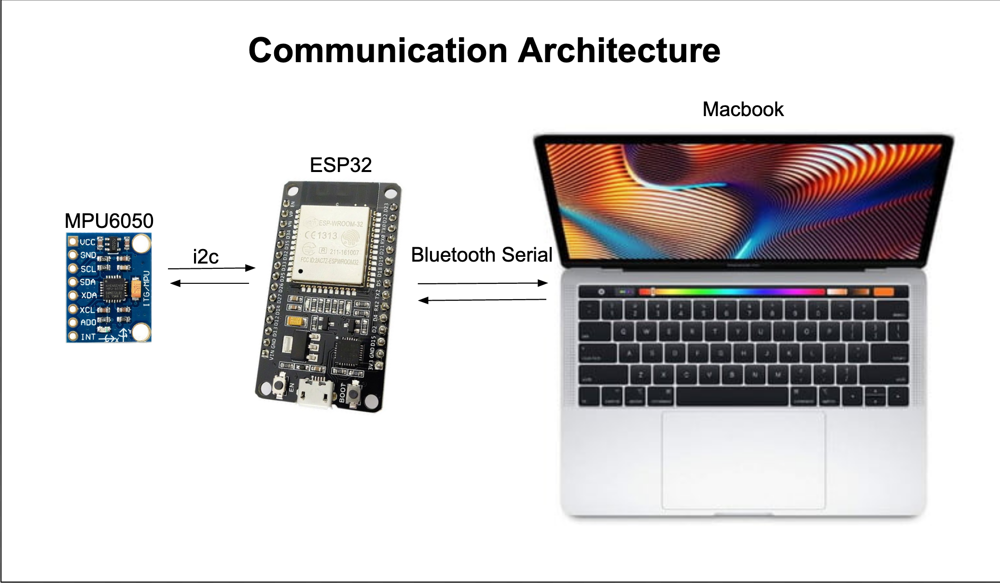
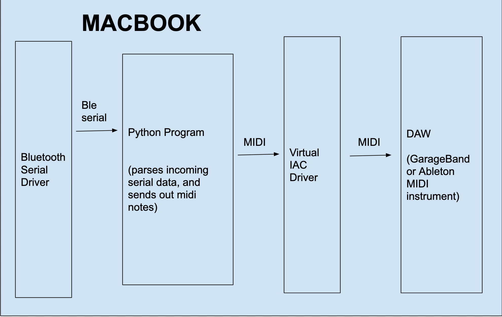
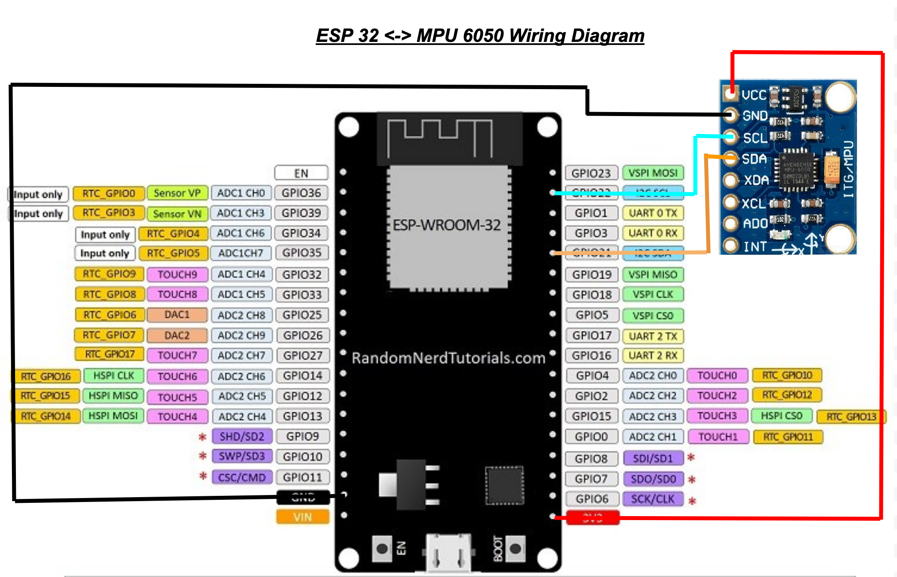

# ESP 32 Bluetooth Midi Instrument

## Introduction

This is a simple midi instrument created using an esp32 and an accelerometer. When the device is moved around midi notes are produced.

## Preview

Click on the image below to play the video demo of the instrument

## Detailed Overview

This project consists of two different programs interacting with each other.

The first part is a simple esp32 chip reading accelerometer data over i2c and sending it over bluetooth serial. In this scenario the esp32 acts as the i2c master while the mpu6050 sensor is the slave. The esp32 regularly enquires for the sensor data. In this situation every 10ms. This can be changed in the `esp32-accelerometer-over-ble-serial.ino` file. Next the esp32 is accepting bluetooth connections, whenever a device pairs to it, it sends this accelerometer data over bluetooth serial. The architecture diagram is shown below.

The second part is a python program that reads the incoming serial data and generates midi notes based on the movement of the esp32 device. These midi notes can be used to play a live instrument using a DAW like Ableton or GarageBand. The detailed architecture diagram is shown below.

## Bill of Materials

1. Breadboard
2. Esp32s with header pins soldered
3. MPU6050 (accelerometer) breakout board with header pins soldered
4. jumper wires
5. Micro usb cable
6. MacBook Computer
7. DAW (Ableton or GarageBand)

## Connecting the Electronics

Please wire up the esp32s as shown in the diagram below. You may need to modify the connections for SDA, SCL based on your esp device. For me SDA was pin 21, and SCL was pin 22

## Setting Up Your PC

You will need a few programs installed on your machine. Python3.7+, DAW (GarageBand or Ableton), Arduino IDE

You will also need to set up a VIRTUAL midi bus so you can send data to the DAW. Please follow instructions here: https://help.ableton.com/hc/en-us/articles/209774225-How-to-setup-a-virtual-MIDI-bus

## Getting Your ESP Ready

1. update Arduino IDE and use Board Manager to ensure the software for your chip is installed
2. Connect the esp32 to the ide
3. Load the esp32-accelerometer-over-ble-serial.ino file, and ensure the correct corresponding pins are set for SDA SCL. (Lines 13,14)
4. Verify the program, and upload to your board. You may need to hold down the program button.
5. Once flashed, if you open and scan for bluetooth you should be able to pair with the ESP's bluetooth, it should be called "E-nstrument". Please proceed with pairing with the device.

## Getting The Python Program Going

1. Ensure you have python3.7 and pipenv installed
2. run `pipenv shell`, it will activate a virtual env
3. run `pipenv install` this will install the dependencies of the project
4. Now go to bluetooth and pair with "E-nstrument" on your mac
5. Once paired. Run `python3 app.py` . The most likely scenario is the name of the serial port on my machine might not match yours. If this is the case you should see all your available serial ports printed out in std. Please set `SERIAL_PORT` variable to the corresponding one for the E-nstrument device on your machine. If your lucky and the names are the same, the program should automatically try to start receiving accelerometer data. If you see `Receiving accelerometer data! You can start waving your e-instrument to produce midi notes!`, you can start waving the device, and you should see different midi notes being played on std, example output: `Playing: note_on channel=0 note=41 velocity=64 time=0.01`.
6. Now you can open your daw of choice and open up an instrument that works over midi. Ensure the midi input channel is set to the previously configured IAC Driver Bus 1, if yours is called something else, you can open `app.py` and modify this in line 21 and rerun the script.
7. Now if you wave around the device, you should here your midi instrument on your DAW being played. In the demo video I play the Digital Chords Arpeggiator on GarageBand.

## Future Improvements

1. Currently the python program does not have a smart algorithm in place to ensure that whatever is played always sounds quantized. So this should be re-implemented.
2. The algorithm also only converts some values from the sensor to midi, this should be changed so every orientation may have a different note, and these movements might play melodic midi notes one after another. For this we can start with building an algorithm that parses the sensor data and outputs orientation + motion direction + motion force.
3. A cool plotting mechanism of this data might also be useful in developing a better algorithm for accelerometer -> midi data conversion. I was initially using arduino serial plotter when I started building this to see what movements cause which signals to change.
4. Look into using wifi and a protocol like websockets to see if its faster than bluetooth serial.
5. Switch to async serial so instead of manually sleeping in python script we just await for messages
6. Currently the last sensor values are used to convert into midi notes, but instead maybe it would be better to save a few signal points and run a filter through the values to determine whether to play midi notes or not.
