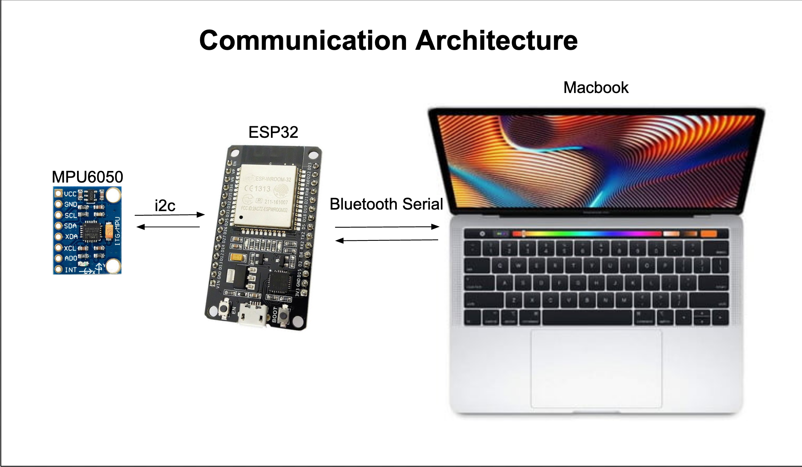
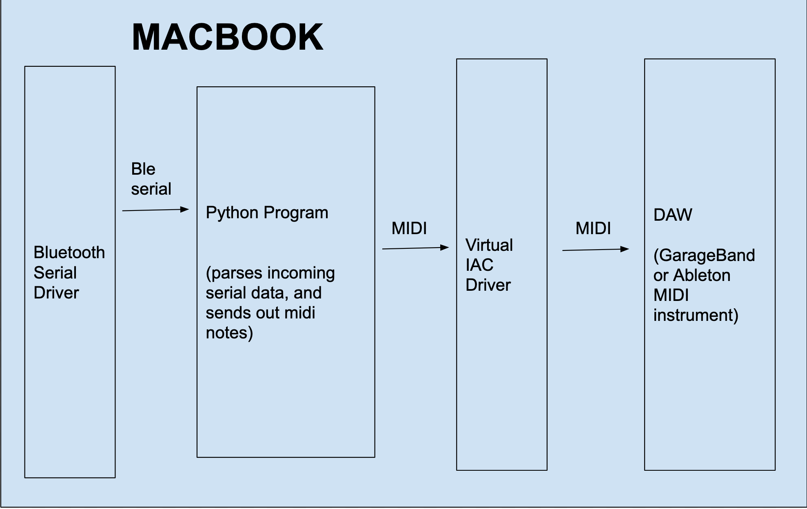
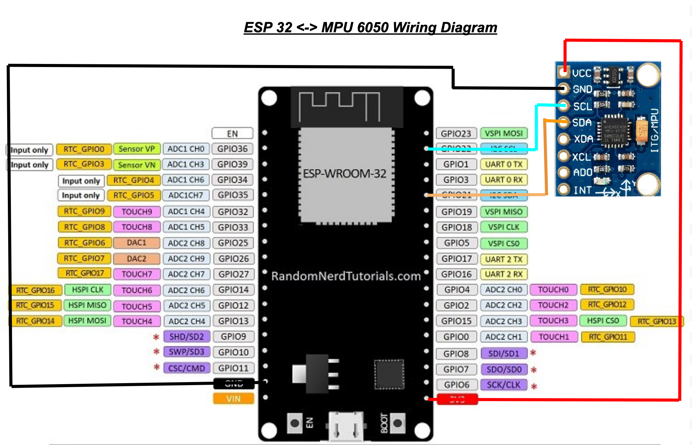

ESP 32 Bluetooth Midi Instrument
================================

Introduction
------------

This is a simple midi instrument created using an esp32 and an
accelerometer. When the device is moved around midi notes are produced.

Preview
-------

Click on the image below to play the video demo of the instrument

|DEMO|

Detailed Overview
-----------------

This project consists of two different programs interacting with each
other.

The first part is a simple esp32 chip reading accelerometer data over
i2c and sending it over bluetooth serial. In this scenario the esp32
acts as the i2c master while the mpu6050 sensor is the slave. The esp32
regularly enquires for the sensor data. In this situation every 10ms.
This can be changed in the ``esp32-accelerometer-over-ble-serial.ino``
file. Next the esp32 is accepting bluetooth connections, whenever a
device pairs to it, it sends this accelerometer data over bluetooth
serial. The architecture diagram is shown below.

   Diagram 1
The second part is a python program that reads the incoming serial data
and generates midi notes based on the movement of the esp32 device.
These midi notes can be used to play a live instrument using a DAW like
Ableton or GarageBand. The detailed architecture diagram is shown below.

   Diagram 2
Bill of Materials
-----------------

1. Breadboard
2. Esp32s with header pins soldered
3. MPU6050 (accelerometer) breakout board with header pins soldered
4. jumper wires
5. Micro usb cable
6. MacBook Computer
7. DAW (Ableton or GarageBand)

Connecting the Electronics
--------------------------

Please wire up the esp32s as shown in the diagram below. You may need to
modify the connections for SDA, SCL based on your esp device. For me SDA
was pin 21, and SCL was pin 22

   Wiring
Setting Up Your PC
------------------

You will need a few programs installed on your machine. Python3.7+, DAW
(GarageBand or Ableton), Arduino IDE

You will also need to set up a VIRTUAL midi bus so you can send data to
the DAW. Please follow instructions here:
https://help.ableton.com/hc/en-us/articles/209774225-How-to-setup-a-virtual-MIDI-bus

Getting Your ESP Ready
----------------------

1. update Arduino IDE and use Board Manager to ensure the software for
   your chip is installed
2. Connect the esp32 to the ide
3. Load the esp32-accelerometer-over-ble-serial.ino file, and ensure the
   correct corresponding pins are set for SDA SCL. (Lines 13,14)
4. Verify the program, and upload to your board. You may need to hold
   down the program button.
5. Once flashed, if you open and scan for bluetooth you should be able
   to pair with the ESP's bluetooth, it should be called "E-nstrument".
   Please proceed with pairing with the device.

Getting The Python Program Going
--------------------------------

1. Ensure you have python3.7 and poetry installed
2. run ``poetry install`` this will install the dependencies of the
   project
3. Now go to bluetooth and pair with "E-nstrument" on your mac
4. Once paired. Run ``poetry run python3 app.py`` . The most likely scenario is the
   name of the serial port on my machine might not match yours. If this
   is the case you should see all your available serial ports printed
   out in std. Please set ``SERIAL_PORT`` variable to the corresponding
   one for the E-nstrument device on your machine. If your lucky and the
   names are the same, the program should automatically try to start
   receiving accelerometer data. If you see
   ``Receiving accelerometer data! You can start waving your e-instrument to produce midi notes!``,
   you can start waving the device, and you should see different midi
   notes being played on std, example output:
   ``Playing: note_on channel=0 note=41 velocity=64 time=0.01``.
6. Now you can open your daw of choice and open up an instrument that
   works over midi. Ensure the midi input channel is set to the
   previously configured IAC Driver Bus 1, if yours is called something
   else, you can open ``app.py`` and modify this in line 21 and rerun
   the script.
7. Now if you wave around the device, you should here your midi
   instrument on your DAW being played. In the demo video I play the
   Digital Chords Arpeggiator on GarageBand.

Future Improvements
-------------------

1. Currently the python program does not have a smart algorithm in place
   to ensure that whatever is played always sounds quantized. So this
   should be re-implemented.
2. The algorithm also only converts some values from the sensor to midi,
   this should be changed so every orientation may have a different
   note, and these movements might play melodic midi notes one after
   another. For this we can start with building an algorithm that parses
   the sensor data and outputs orientation + motion direction + motion
   force.
3. A cool plotting mechanism of this data might also be useful in
   developing a better algorithm for accelerometer -> midi data
   conversion. I was initially using arduino serial plotter when I
   started building this to see what movements cause which signals to
   change.
4. Look into using wifi and a protocol like websockets to see if its
   faster than bluetooth serial.
5. Switch to async serial so instead of manually sleeping in python
   script we just await for messages
6. Currently the last sensor values are used to convert into midi notes,
   but instead maybe it would be better to save a few signal points and
   run a filter through the values to determine whether to play midi
   notes or not.

.. |DEMO| image:: images/preview.png
   :target: https://youtu.be/KOrp2Lvx4k4
